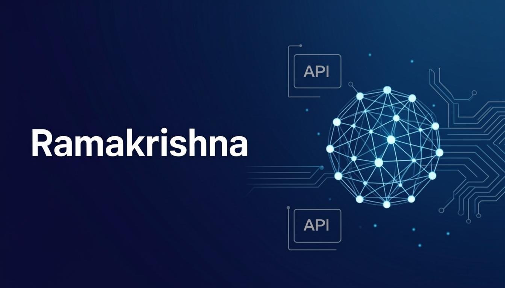

#  Hey there, I'm Ramakrishna!

<div align="center">

[](https://git.io/typing-svg)

</div>

---

##  About Me

I'm a passionate developer focused on building **AI-powered applications** that solve real-world problems. I love combining the intelligence of Large Language Models with clean, responsive web interfaces to create tools that genuinely help people work smarter.

- 🔭 Currently working on **AI-driven automation tools & intelligent web applications**
- 🌱 Exploring **Advanced NLP, RAG architectures & Generative AI**
- 💡 Passionate about **making AI accessible through intuitive user experiences**
- 🛠️ Love building end-to-end projects — from model integration to polished UI
- 🤝 Open to collaborating on **AI/ML projects and open-source tools**
- ⚡ Fun fact: I believe the best code is the one that makes someone's day easier

---

##  Tech Stack

<table>
<tr>
<td valign="top" width="50%">

### 🎨 Frontend


</td>
<td valign="top" width="50%">

### ⚙️ Backend & AI/ML


</td>
</tr>
<tr>
<td valign="top" width="50%">

### 🧠 AI & Data


</td>
<td valign="top" width="50%">

### 🔧 Tools & Platforms


</td>
</tr>
</table>

---

##  Featured Projects

<table>
<tr>
<td width="50%">

### 🤖 [AI Personal Assistant](https://github.com/ramakrishna-rk7/ai-chatbot-project)
An intelligent AI assistant powered by **OpenAI GPT API** with a beautiful responsive web interface. Features multiple assistant modes, conversation history, sentiment analysis, dark mode, and voice input support.

`Python` `OpenAI GPT-4` `JavaScript` `REST API` `Sentiment Analysis`

</td>
<td width="50%">

### 🎙️ [Meeting Transcriber](https://github.com/ramakrishna-rk7/meeting-transcriber)
AI-powered tool that converts audio meeting recordings into written transcripts and automatically summarizes key discussion points and action items using **Whisper** and **HuggingFace Transformers**.

`Python` `Whisper` `Transformers` `Streamlit` `NLP`

</td>
</tr>
<tr>
<td width="50%">

### 💬 [FAQ Chatbot](https://github.com/ramakrishna-rk7/Faq_Chatbot)
A GPT-powered FAQ chatbot with a React frontend and Express backend. Answers user queries intelligently based on predefined FAQs with context-aware responses.

`React` `Express.js` `OpenAI API` `Node.js` `JavaScript`

</td>
<td width="50%">

### 🛒 [ShopSmart Grocery WebApp](https://github.com/ramakrishna-rk7/shopsmart-grocery-webapp)
A modern grocery shopping web application with a clean, intuitive interface for browsing and managing grocery needs.

`HTML` `CSS` `JavaScript` `Web App` `Responsive Design`

</td>
</tr>
<tr>
<td width="50%">

### 🎬 [Movie Recommendation System](https://github.com/ramakrishna-rk7/Movie_Recommendation_systems)
An intelligent movie recommendation engine that suggests personalized movies using **content-based and collaborative filtering** techniques.

`Python` `Machine Learning` `Pandas` `Recommendation Systems`

</td>
<td width="50%">

### 📡 [Drone Telemetry Simulation](https://github.com/ramakrishna-rk7/Drone_Telemetry_Simulation_Project)
A simulation project for drone telemetry data visualization, enabling real-time monitoring and analysis of flight parameters.

`HTML` `JavaScript` `Simulation` `Data Visualization`

</td>
</tr>
<tr>
<td width="50%">

### 💼 [Job Finder](https://github.com/ramakrishna-rk7/job_finder)
A Python-based job search tool that helps streamline the job hunting process with smart filtering and aggregation capabilities.

`Python` `Web Scraping` `Automation` `Job Search`

</td>
<td width="50%">

### 📱 [YouTube AI Telegram Bot](https://github.com/ramakrishna-rk7/youtube-ai-telegram-bot)
A Telegram bot powered by AI that interacts with YouTube content, providing intelligent summaries and insights on demand.

`Python` `Telegram API` `YouTube API` `AI Integration`

</td>
</tr>
</table>

---

##  What I Bring to the Table

```python
class Ramakrishna:
    def __init__(self):
        self.name = "Ramakrishna"
        self.role = "AI & Full-Stack Developer"
        self.languages = ["Python", "JavaScript", "HTML/CSS"]
        self.ai_stack = ["OpenAI GPT", "Whisper", "HuggingFace Transformers", "NLP"]
        self.frontend = ["React", "Streamlit", "Responsive Web Design"]
        self.backend = ["Node.js", "Express.js", "REST APIs"]
        self.motto = "Build AI that people actually want to use"

    def current_focus(self):
        return [
            "Large Language Model Applications",
            "AI-Powered Automation",
            "Intelligent Web Interfaces",
            "Real-World Problem Solving"
        ]

    def collaborate(self):
        return "Always open to exciting AI/ML and open-source projects!"
```

---

##  GitHub Stats

<div align="center">


</div>

<div align="center">

[](https://github.com/anuraghazra/github-readme-stats)

</div>

<div align="center">

[](https://github.com/ashutosh00710/github-readme-activity-graph)

</div>

---

##  Let's Connect

<div align="center">

[](https://github.com/ramakrishna-rk7)

</div>

---

<div align="center">


</div>

<div align="center">

<br>

*"The best way to predict the future is to build it."*

<br>


</div>
